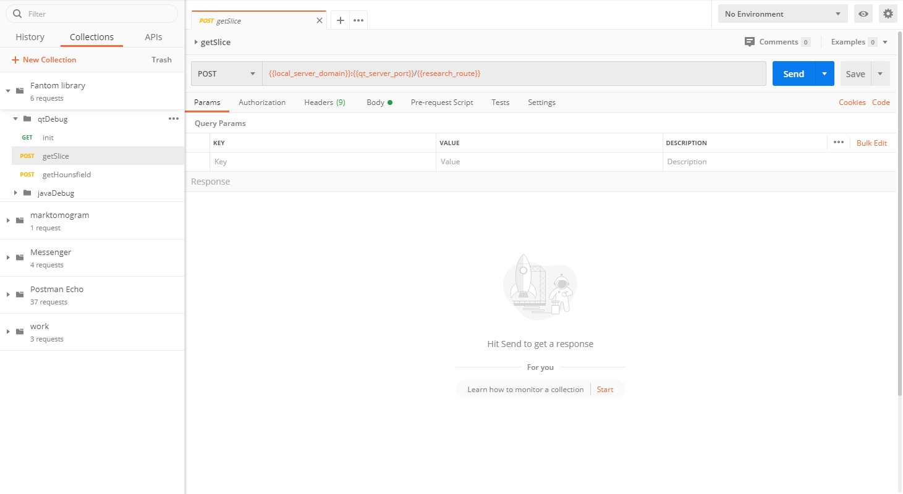
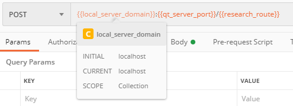
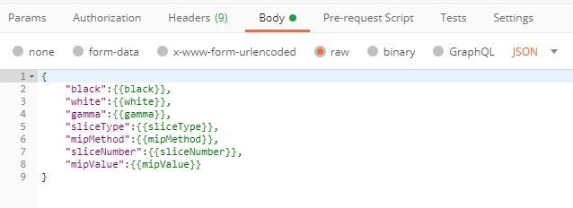
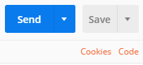
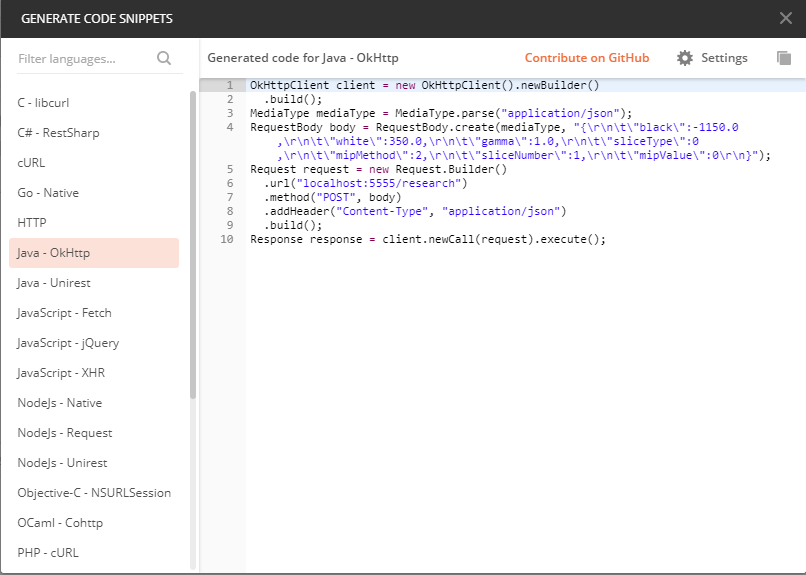

# Тестирование library-server с помощью Postman

## Установка
Главная страница приложение - https://www.postman.com/
Доступно для Linux, MacOS, Windows.
Скачиваем приложение, устанавливаем.

## Общее описание
Программа Postman используется для тестирования api-сервисов, которые не выдают визуального отображения, а общаются посредством «запрос-ответ».
Программа содержит 2 основные области:
- список запросов. В данной области отображается история выполненных запросов и коллекции 
- окно работы с запросом. В данной области отображаются вкладки запросов (как в браузере), строка url запроса, набор основных частей запроса и окно отображения future ответа

## Конфигурация
Для удобства работы, была создана коллекция тестовых запросов в postman
Для того, чтобы данная коллекция появилась в Postman, необходимо импортировать файл «Fantom library.postman_collection» в Postman. Для этого есть кнопка import в верхней левой части программы. Данная коллекция будет доступна в вкладке collections.

  

Внутри конфигурации коллекции для удобства работы были созданы переменные.

 
 
Экран редактирования переменных.

Данная коллекция содержит 2 под коллекции – для qt и для java
Рассмотрим QT под коллекцию
Данная под коллекция содержит 3 основных запроса
•	Запрос на получение данных исследования
•	Запрос на получение изображения
•	Запрос на получение единиц Хаунсфилда
Для примера возьмем запрос под названием getSlice
 
 

В url строке указан конечный адрес api-сервиса, сформированный из переменных. При наведении на переменную, отображается ее реальное значение
 
 

При переходе в вкладку body видно, что для данного запроса в поле body используется json.
При формировании запроса в body, как и в других частях приложения, мы можем подставлять переменные.
 
 

При нажатии клавиши Code (клавиша code), мы может посмотреть, как будет выглядеть реализация запроса на большом количестве современных языков (пример реализации на языке).
 
 
 
 
 
Для отправки запроса нажимаем клавишу Send.
